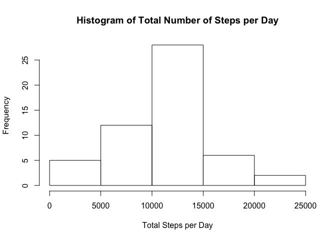
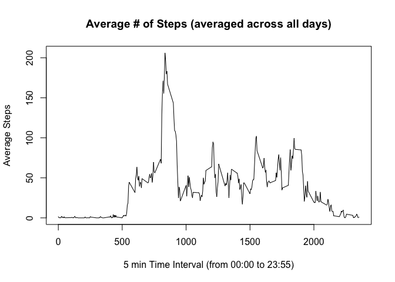
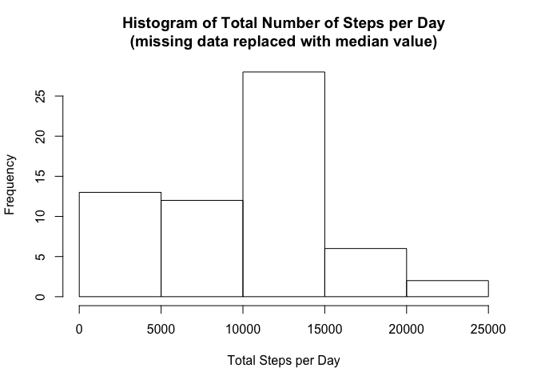
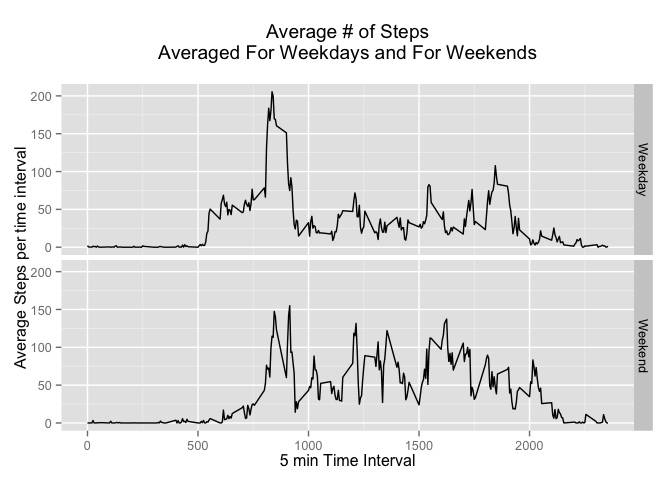

# Reproducible Research: Peer Assessment 1


## Loading and preprocessing the data

```r
activity.df <- read.csv("activity.csv")

## Get a summary of data 
summary(activity.df)
```

```
##      steps                date          interval     
##  Min.   :  0.00   2012-10-01:  288   Min.   :   0.0  
##  1st Qu.:  0.00   2012-10-02:  288   1st Qu.: 588.8  
##  Median :  0.00   2012-10-03:  288   Median :1177.5  
##  Mean   : 37.38   2012-10-04:  288   Mean   :1177.5  
##  3rd Qu.: 12.00   2012-10-05:  288   3rd Qu.:1766.2  
##  Max.   :806.00   2012-10-06:  288   Max.   :2355.0  
##  NA's   :2304     (Other)   :15840
```

```r
## Convert to data table for faster downstream processing
library(data.table)
activity.dt <- data.table(activity.df)
```

## What is mean total number of steps taken per day?
1. Make a histogram of the total number of steps taken each day

```r
activity.dt.sum <- activity.dt[, lapply(.SD, sum), by = date, .SDcols="steps"]
par(mfrow = c(1, 1)) ## (a,) L -> R ; (,b) T -> B;
hist(activity.dt.sum$steps, main = "Histogram of Total Number of Steps per Day", xlab = "Total Steps per Day")
```

 

2. Calculate and report the mean and median total number of steps taken per day

```r
mean(activity.dt.sum$steps, na.rm = TRUE)
```

```
## [1] 10766.19
```

```r
median(activity.dt.sum$steps, na.rm = TRUE)
```

```
## [1] 10765
```

## What is the average daily activity pattern?
1. Make a time series plot (i.e. type = "l") of the 5-minute interval (x-axis) and the average number of steps taken, averaged across all days (y-axis)

```r
interval.step.ave <- activity.dt[, lapply(.SD, mean, na.rm = TRUE), by = interval, .SDcols="steps"]
par(mfrow = c(1, 1)) ## (a,) L -> R ; (,b) T -> B;
plot(interval.step.ave$interval, interval.step.ave$steps, type = "l", 
     main = "Average # of Steps (averaged across all days)", xlab = "5 min Time Interval (from 00:00 to 23:55)", ylab = "Average Steps")
```

 

2. Which 5 minute time interval, on average across all the days in the dataset, contains the maximum number of steps?

```r
interval.step.ave[which.max(interval.step.ave[,steps]),interval]
```

```
## [1] 835
```

## Imputing missing values

Note that there are a number of days/intervals where there are missing
values (coded as `NA`). The presence of missing days may introduce
bias into some calculations or summaries of the data.

1. Calculate and report the total number of missing values in the dataset (i.e. the total number of rows with `NA`s)

```r
length(which(is.na(activity.df$steps)))
```

```
## [1] 2304
```

2. Devise a strategy for filling in all of the missing values in the dataset. The strategy does not need to be sophisticated. For example, you could use the mean/median for that day, or the mean for that 5-minute interval, etc.

```r
## Use "median"" steps of respective time interval across all days as the value to replace "NA"" steps
interval.step.median <- activity.dt[, lapply(.SD, median, na.rm = TRUE), by = interval, .SDcols="steps"]
```

3. Create a new dataset that is equal to the original dataset but with the missing data filled in.

```r
activity.dt.fixd <- activity.dt
activity.dt.fixd$steps[is.na(activity.dt.fixd$steps)] <- 
  interval.step.median$steps[match(activity.dt.fixd$interval[is.na(activity.dt.fixd$steps)], interval.step.median$interval)]
```

4. (a) Make a histogram of the total number of steps taken each day and Calculate and report the **mean** and **median** total number of steps taken per day. Do these values differ from the estimates from the first part of the assignment? 

```r
activity.dt.sum.fixd <- activity.dt.fixd[, lapply(.SD, sum), by = date, .SDcols="steps"]
par(mfrow = c(1, 1)) ## (a,) L -> R ; (,b) T -> B;
hist(activity.dt.sum.fixd$steps, main = "Histogram of Total Number of Steps per Day\n(missing data replaced with median value)", xlab = "Total Steps per Day")
```

 

```r
mean(activity.dt.sum.fixd$steps, na.rm = TRUE)
```

```
## [1] 9503.869
```

```r
median(activity.dt.sum.fixd$steps, na.rm = TRUE)
```

```
## [1] 10395
```

4. (b) What is the impact of imputing missing data on the estimates of the total daily number of steps?

*I used the median value for the time intervals.  Both the mean and median changed.  
The mean was lower due to the increased number of days with a lower total step count.
The median did not move much as the replaced missing data being a reflection of the existing measured medians.
Replacing missing values with measures of mean or median causes a bias towards centrality.*

## Are there differences in activity patterns between weekdays and weekends?
For this part the `weekdays()` function may be of some help here. Use the dataset with the filled-in missing values for this part.

1. Create a new factor variable in the dataset with two levels -- "weekday" and "weekend" indicating whether a given date is a weekday or weekend day.

```r
activity.dt.fixd$dayclass <- as.factor(ifelse(weekdays(as.Date(activity.dt.fixd$date)) %in% c("Saturday", "Sunday"),
                                                 "Weekend", "Weekday"))
summary(activity.dt.fixd)
```

```
##      steps             date          interval         dayclass    
##  Min.   :  0   2012-10-01:  288   Min.   :   0.0   Weekday:12960  
##  1st Qu.:  0   2012-10-02:  288   1st Qu.: 588.8   Weekend: 4608  
##  Median :  0   2012-10-03:  288   Median :1177.5                  
##  Mean   : 33   2012-10-04:  288   Mean   :1177.5                  
##  3rd Qu.:  8   2012-10-05:  288   3rd Qu.:1766.2                  
##  Max.   :806   2012-10-06:  288   Max.   :2355.0                  
##                (Other)   :15840
```

1. Make a panel plot containing a time series plot (i.e. `type = "l"`) of the 5-minute interval (x-axis) and the average number of steps taken, averaged across all weekday days or weekend days (y-axis). The plot should look something like the following, which was created using **simulated data**:

```r
interval.step.ave.fixd <- activity.dt.fixd[, lapply(.SD, mean, na.rm = TRUE), by = c("interval", "dayclass"), .SDcols="steps"]
library(ggplot2)
## do plot using ggplot
g <- ggplot(aes(x = interval, y = steps, fill = dayclass), data = interval.step.ave.fixd)
g + geom_line(stat = "identity") +
  facet_grid(dayclass ~ .) +
  labs(x = "5 min Time Interval", y = "Average Steps per time interval") + 
  labs(title = "Average # of Steps\nAveraged For Weekdays and For Weekends\n") +
  guides(fill=FALSE)
```

 
